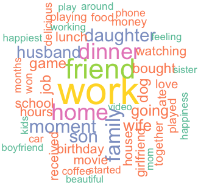

## What is HappyDB?
HappyDB is a corpus of 100,000 crowd-sourced happy moments.
The goal of the corpus is to advance the state of the art
of understanding the causes of happiness that can be gleaned
from text.

<p align="center">

</p>
* * *
## Using the dataset?
For details on how HappyDB was created, check out our [paper](https://arxiv.org/abs/1801.07746).
If you use HappyDB in your work, please cite the paper as:

```
@inproceedings{asai2018happydb, 
  title = {HappyDB: A Corpus of 100,000 Crowdsourced Happy Moments}, 
  author = {Asai, Akari and Evensen, Sara and Golshan, Behzad and Halevy, Alon
  and Li, Vivian and Lopatenko, Andrei and Stepanov, Daniela and Suhara, Yoshihiko
  and Tan, Wang-Chiew and Xu, Yinzhan}, 
  booktitle = {Proceedings of LREC 2018},  
  month = {May},   year={2018}, 
  address = {Miyazaki, Japan}, 
  publisher = {European Language Resources Association (ELRA)}
}
```

<br>
* * *
## Dataset description
Simply stated, HappyDB is a collection of happy moments described by 
individuals experiencing those moments. The following are some examples:

<div class="highlighter-rouge">
<pre class="highlight">
<script type="text/javascript">
    readStringFromFileAtPath = function(pathOfFileToReadFrom)
    {
        var request = new XMLHttpRequest();
        request.open("GET", pathOfFileToReadFrom, false);
        request.send(null);
        var returnValue = request.responseText;

        return returnValue;
    }
    var sent = readStringFromFileAtPath('hm_sample.txt').split("\n");
    document.write("<code id=\"sent\">");
    for (i=1; i<6; i++) {
        var id=Math.round(Math.random()*(sent.length-1));
        document.write(i.toString() + ". ");
        document.write(sent[id]);
        if (i != 5) {
            document.write("\n");
        }
    }
    document.write("</code>");
    change = function()
    {
        var sent = readStringFromFileAtPath('hm_sample.txt').split("\n");
        st = ""
        for (i=1; i<6; i++) {
            var id=Math.round(Math.random()*(sent.length-1));
            st += (i.toString() + ". ");
            st += sent[id];
            if (i != 5) {
                st += "\n";
            }
        }
        console.log(document.getElementById("sent").textContent);
        document.getElementById("sent").textContent = st;
    }
</script>
</pre>
</div>
<style type="text/css">
.myButton {
	background-color:#44c767;
	-moz-border-radius:28px;
	-webkit-border-radius:28px;
	border-radius:28px;
	border:1px solid #18ab29;
	display:inline-block;
	cursor:pointer;
	color:#ffffff;
	font-family:Arial;
	font-size:17px;
	padding:16px 31px;
	text-decoration:none;
	text-shadow:0px 1px 0px #2f6627;
}
.myButton:hover {
	background-color:#5cbf2a;
}
.myButton:active {
	position:relative;
	top:1px;
}
</style>
<center>
<input onclick="change()" type="button" class="myButton" value="More examples!">
</center>

#### Collecting happy moments
The happy moments are crowd-sourced via Amazon's Mechanical Turk. We presented
each worker with the following task:
```
What made you happy today? Reflect on the past 24 hours, and recall
three actual events that happened to you that made you happy. Write
down your happy moment in a complete sentence.
(Write three such moments.)
```
In this task, the "past 24 hours" is what we call the _reflection period_.
HappyDB also contains happy moments with reflection periods "past week" and
"past month".

Along with each happy moment, we have collected the demographic information of
the worker who provided the moment. 

#### Lab in the wild
To further provide resources for researchers interested in the
science of happiness, we have partnered with __Lab In The Wild__ to collect
more happy moments. We encourage you to take a look at our task on Lab In The
Wild. 
<center>
<a href="http://happiness.labinthewild.org/" class="myButton">Lab In The Wild</a>
</center>

#### Cleaning the corpus
The HappyDB corpus, like any other human-generated data, has errors and requires cleaning.
Many workers did not write down complete sentences or had spelling errors. To make using
the corpus more convenient, we have created a clean version of the corpus that deals with
the issues mentioned earlier. More specifically, we have:
1. removed any happy moment that consists of a single word,
1. corrected the misspelled words (if we could infer the correct spelling from the context). 
